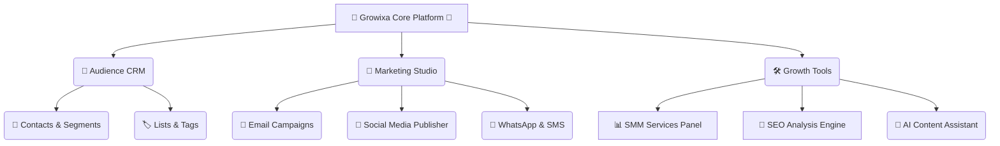

# 🚀 Growixa — The Ultimate AI Growth & Telemetry Platform 🌟

Welcome to **Growixa**! 🚀 This is an incredibly powerful, **Expert-Grade Chart Analysis & Growth Telemetry Engine**. Think of it as a Bloomberg Terminal or TradingView, but supercharged for **Marketing, Audience Growth, and AI Execution**! 📊📈

We've designed Growixa to be **beautiful**, **fast**, and **intelligent**. It tracks every data point across Audience, Email Delivery, and Conversions using institutional precision! 🎯

---

## 🏗️ How Growixa is Built (Platform Architecture) 🏢

Growixa is a massive ecosystem divided into smart hubs:



---

## 📈 Supercharged Chart Analysis & Growth Telemetry 📉

We didn't just build charts; we built a **Zero-Dependency SVG Chart Analysis Terminal** right inside the app! 💻🔥

1. **🕯️ Interactive Candlesticks & Area Charts**:
   - **Candlestick Mode**: Sprint cycle modeling with Open, High, Low, and Close values. Beautiful Emerald (`#10b981`) 🟢 for growth and Crimson (`#f43f5e`) 🔴 for corrections!
   - **Area Mode**: Super smooth curves with glowing gradient filters! ✨
   - **Crosshairs**: Real-time cursor tracking for timestamps, RSI, and conversion rates! ⏱️
2. **🕒 Multi-Timeframe Magic**: Switch between `1H`, `24H`, `7D`, `30D`, `90D`, and `1Y` with a single click! ⚡
3. **📊 Technical Overlays**:
   - **Moving Averages**: Fast EMA 9 (cyan) 💧 and Trend EMA 21 (gold) 🌟.
   - **RSI (14)**: Momentum oscillator for your growth! 🌊
   - **Volume Histogram**: Real-time campaign dispatch bars! 📏
4. **📡 Live Telemetry Stream**: Watch your campaign dispatches, AI subject line uplifts, and audience syncs in real-time! ⚡
5. **🧠 Institutional Quant Metrics**: Features like Sharpe Growth Ratio, Delivery Alpha, and CAC Velocity Delta. Because your marketing deserves math! 🧮

---

## 🎨 Visual Design & Aesthetics 💎

We built Growixa to look like it's from the future! 🛸
- **💧 Liquid Glass Aesthetic**: Frosted pill capsules, glowing backdrops, and 3D floating elements!
- **🧊 3D Tactile Automation**: Dynamic fluid workflows that feel alive.
- **🌙 Trading Terminal Theme**: A deep dark slate canvas (`#070a12`) with subtle neon highlights and tabular monospace text!

---

## 🏁 Quick Start: Run Growixa Locally 💻

Want to see the magic on your own computer? Follow these steps! 👇

### 1️⃣ Prerequisites 🧰
Make sure you have these installed:
- 🟢 **Node.js 20+** & **npm**
- 🐍 **Python 3.11+** & **Poetry / virtualenv**
- 🐳 **Docker** & **Docker Compose** (for PostgreSQL and Redis)

### 2️⃣ Frontend Setup (Next.js) 🌐
```bash
cd apps/web
npm install
npm run dev
```
Open **`http://localhost:3000`** in your browser and check out these awesome pages:
- 🏠 **Homepage**: `http://localhost:3000/`
- 🎛️ **Growth Command Center**: `http://localhost:3000/dashboard`
- 💳 **Pricing**: `http://localhost:3000/pricing`
- 🔐 **Login**: `http://localhost:3000/login`

### 3️⃣ Backend Setup (FastAPI) ⚙️
```bash
cd apps/api
python -m uvicorn growixa_api.app:app --host 0.0.0.0 --port 8000 --reload
```
Check out the fully automated API Docs here: 📖 `http://localhost:8000/docs`

---

## ✅ CI/CD & Testing (We Take Quality Seriously) 🛡️

Before anything is merged, our automated robots 🤖 run these checks to keep the code 100% green 🟢:

```bash
# 🖥️ Frontend (apps/web)
npm run test          # Runs 370+ Vitest tests! 🧪
npm run lint          # ESLint code styling 🧹
npm run typecheck     # TypeScript strict verification 🛡️
npm run build         # Next.js production build 🚀

# ⚙️ Backend (apps/api)
pytest                # Full Python test suite 🐍
ruff check .          # Blazing fast Python linter ⚡
mypy .                # Static typing checks 🔍
```

---

## 📚 Want to Learn More? (Documentation) 📂

Check out our deep-dive documents to understand how everything works under the hood! 🕵️‍♂️
- 📝 [`docs/01-product/PRD.md`](docs/01-product/PRD.md) — The master plan! (Product Requirements)
- 📌 [`docs/00-project-control/MASTER_TASK_TRACKER.md`](docs/00-project-control/MASTER_TASK_TRACKER.md) — Where we track all our tasks.
- 🚦 [`docs/12-development/AGENT_EXECUTION_RULES.md`](docs/12-development/AGENT_EXECUTION_RULES.md) — How AI agents code in this repo.
- 🔐 [`AGENTS.md`](AGENTS.md) — Security rules, git conventions, and branch rules!

---

**Made with ❤️ and ☕ for Growth Engineers worldwide!** 🌍🚀
