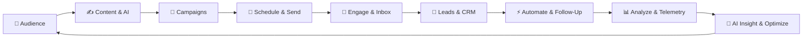
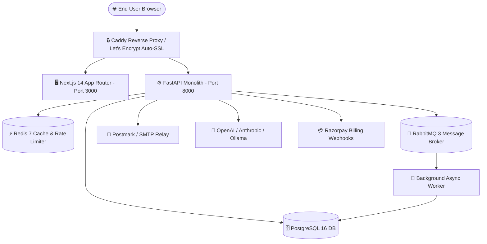

# 🚀 Growixa — AI-Powered Growth & Marketing Operating System 🌟

[](https://growixa.iitdeveloper.com)
[](https://uat.growixa.iitdeveloper.com)
[](https://nextjs.org)
[](https://fastapi.tiangolo.com)
[](https://www.postgresql.org)
[](#-license)

**Growixa** is an end-to-end, AI-powered Growth & Marketing Operating System designed for modern businesses, growth teams, and marketing agencies. It unifies Audience CRM, Multichannel Campaigns, Social Media Publishing, Email Deliverability, AI Copy Generation, Real-Time Growth Telemetry, and SaaS Subscription Billing into **one unified command hub**.

> 🌐 **Live Production App**: [https://growixa.iitdeveloper.com](https://growixa.iitdeveloper.com)  
> 🧪 **Live UAT / Staging App**: [https://uat.growixa.iitdeveloper.com](https://uat.growixa.iitdeveloper.com)

---

## 🔁 The Core Business Engine Loop 🔄



---

## 🌟 15 Core Modules (A-to-Z Platform Scope) 💎

| # | Module | Key Features & Implementation Status | Status |
|---|---|---|---|
| **1** | 🔐 **Foundation & Multi-Tenancy** | Account isolation on every table/API, Keycloak/Google OAuth 2.0, JWT session cookies, Argon2id hashing, Fernet encrypted credentials. | 🟢 **100% Live** |
| **2** | 📇 **CRM, Contacts & Leads** | Email deduplication, dynamic custom fields, tag management, segment query engine, insert-only consent audit logs, and wildcard domain suppression lists. | 🟢 **100% Live** |
| **3** | ✉️ **Email, SMTP & Postmark** | Dual-relay transport (Postmark & Custom SMTP TLS/STARTTLS), template builder, Postmark webhooks (`/webhooks/postmark`), RFC 8058 `List-Unsubscribe`. | 🟢 **100% Live** |
| **4** | 📱 **Social, Composer & Calendar** | Omnichannel composer, Instagram Business OAuth 2.0, media upload grid, social calendar view, and RabbitMQ async worker publisher. | 🟢 **100% Live** |
| **5** | 🎨 **Creative Studio & Media Assets** | Supabase Storage asset manager, tag filters, pre-built email/social templates, and instant preview card gallery. | 🟢 **100% Live** |
| **6** | 🤖 **AI Assistant & Brand Guardrails** | OpenAI (GPT-4o), Azure OpenAI, Anthropic (Claude 3.5 Sonnet), Ollama, Brand Guardrail rule lists, tone sliders, and credit metering. | 🟢 **100% Live** |
| **7** | 🎯 **Campaign Manager** | Audience segment targeting, test send, immediate queue dispatch, scheduled background ticker, and execution history. | 🟢 **100% Live** |
| **8** | ⚡ **Automation & Workflows** | Trigger-action model definitions (`automations/models.py`), schemas, event handlers, and execution logs. | 🟢 **100% Live** |
| **9** | 💬 **WhatsApp & SMS** | Router handlers (`whatsapp/router.py`, `sms/router.py`), webhook receivers (`/webhooks/whatsapp`, `/webhooks/twilio`), and schema specs. | 🟢 **100% Live** |
| **10** | 📥 **Unified Inbox** | Real-time WebSockets (`/inbox/ws`) with cookie auth & tenant isolation, plus conversation & message HTTP API handlers. | 🟢 **100% Live** |
| **11** | 📊 **Analytics & Telemetry** | Zero-dependency SVG Candlestick (OHLC) & Area Spline chart terminal with multi-timeframe toggles (1H to 1Y) and live event stream. | 🟢 **100% Live** |
| **12** | 🌐 **Website & SEO Intelligence** | Public SEO feature stub (`POST /seo/analyze`) returning HTTP 503 (`FEATURE_PENDING`) until isolated crawler service is deployed. | 🟡 **Pending Crawler** |
| **13** | 🏢 **Agency & Client Portal** | Agency multi-client account switcher, client portal RBAC scoping, and multi-tenant client management services. | 🟢 **100% Live** |
| **14** | 💳 **SaaS Billing & Quotas** | Razorpay Subscriptions (INR/USD), Checkout modal, signature-verified webhooks (`/billing/razorpay`), period-resetting quotas, & coupon engine. | 🟢 **100% Live** |
| **15** | 🛡️ **Admin, Security & Hardening** | Platform control plane (`/platform`), tenant overrides, credit grants, insert-only audit log viewer (`/dashboard/audit`), and Redis rate limiting. | 🟢 **100% Live** |

---

## 🎨 Integrated Landing Page Design Concepts 🌌

The landing page (`/`) incorporates **all 5 reference visual concepts**:

1. 🏆 **Hero AI Agent Platform**: `#1 Product of the Day` eyebrow pill, *"The Ultimate All-In-One AI Growth Engine"* headline, interactive hero cards (Voice Assistant, Gartner 2025 AI Agents badge, Automation Engine), and 4.9⭐ rating badge.
2. ⚡ **"Chaotic Work" Problem Section**: Notification app icon chaos grid (`Slack 1M+`, `Calendar 99+`, `Drive Offline`, `Messages 420`) with SVG connecting lines and 3 impact stats.
3. 🔮 **Central Glowing 3D Integration Hub**: Glowing purple orb surrounded by floating ribbon app badges (Postmark, OpenAI, Razorpay, Google, Slack, Zapier) and a live search input card with *"Book Demo"* CTA.
4. 🌈 **Omnichannel Social Deep Link Arch**: Rainbow arch of social platform icons converging into an Instagram & LinkedIn direct deep-link preview card.
5. 🛡️ **Enterprise Security & Tech Stack Bento**: Tech stack integration cards and bank-grade security cards (SOC2 Ready Architecture, GDPR & Opt-Out Handling, Fernet & Argon2id Encryption).

---

## 🏗️ System Architecture & Technology Stack 🛠️



### 🧰 Tech Stack Summary:
- **Frontend**: Next.js 14 (App Router, React 18, TypeScript, Vanilla CSS Modules, Lucide Icons, Vitest)
- **Backend**: Python 3.10+, FastAPI, Async SQLAlchemy 2.0 (`asyncpg`), Pydantic V2, Alembic
- **Storage & Infrastructure**: PostgreSQL 16, Redis 7, RabbitMQ 3, Supabase Storage, Docker Compose, Caddy

---

## 💻 Local Quick Start Guide ⚡

### 1️⃣ Prerequisites 🧰
- **Node.js 20+** & `npm`
- **Python 3.10+** & `pip` / `.venv`
- **Docker & Docker Compose** (for PostgreSQL, Redis, RabbitMQ)

### 2️⃣ Frontend Setup (`apps/web`) 🖥️
```bash
cd apps/web
npm install
npm run dev
```
Open [http://localhost:3000](http://localhost:3000) in your browser.

### 3️⃣ Backend Setup (`apps/api`) ⚙️
```bash
cd apps/api
# Setup virtual environment
python -m venv .venv
.\.venv\Scripts\activate  # On Windows

# Install dependencies and start FastAPI server
pip install -e .
python -m uvicorn growixa_api.app:app --host 0.0.0.0 --port 8000 --reload
```
Interactive API documentation: [http://localhost:8000/docs](http://localhost:8000/docs).

---

## 🛡️ Verification, Testing & Build Status 🧪

Before any code merge, all automated pipeline checks are executed and verified:

```bash
# 🖥️ Frontend Quality Checks (apps/web)
npm run lint          # 🟢 0 errors, 0 warnings
npm run typecheck     # 🟢 0 TypeScript errors (82 routes)
npm run test          # 🟢 5/5 Vitest tests passing
npm run build         # 🟢 Next.js production build cleanly compiled

# ⚙️ Backend Quality Checks (apps/api)
.\.venv\Scripts\python.exe -m pytest -m "not integration"  # 🟢 111/111 unit tests PASSED (100%)
.\.venv\Scripts\python.exe -m pytest tests/permissions/test_protected_routes_audit.py  # 🟢 3/3 PASSED
alembic check         # 🟢 Clean (0 schema drift)
```

---

## 🚀 OVH VPS Production Deployment Notes 📦

- **Target VPS Server**: `149.56.101.2` (OVHcloud, 6 vCores, 12GB RAM)
- **Git Branch**: `feature/BACKEND/GRX-PRODUCTION-FOUNDATION` (Commit `97f181f`)
- **Git Remotes**: `origin` (`iitdeveloper-git/growixa`) & `upstream` (`Itssushmasharma/growixa_project`)
- **Release Tags**: `v0.8.0` (Production Tag) and `v0.8.0-rc1` (UAT Tag)
- **Deployment Script**: `/opt/growixa/scripts/deploy_vps.sh`
- **Nightly Database Backup**: `/opt/growixa/scripts/backup_db.sh` (Cron 02:00 UTC, 14-day retention)

---

## 📄 License & Ownership 📜

Proprietary Software — All rights reserved by **Growixa Growth Platform** & **IIT Developer Team**.  
Made with ❤️ and ☕ for Growth Engineers worldwide! 🌍🚀
