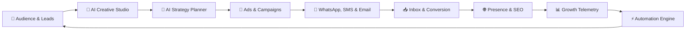
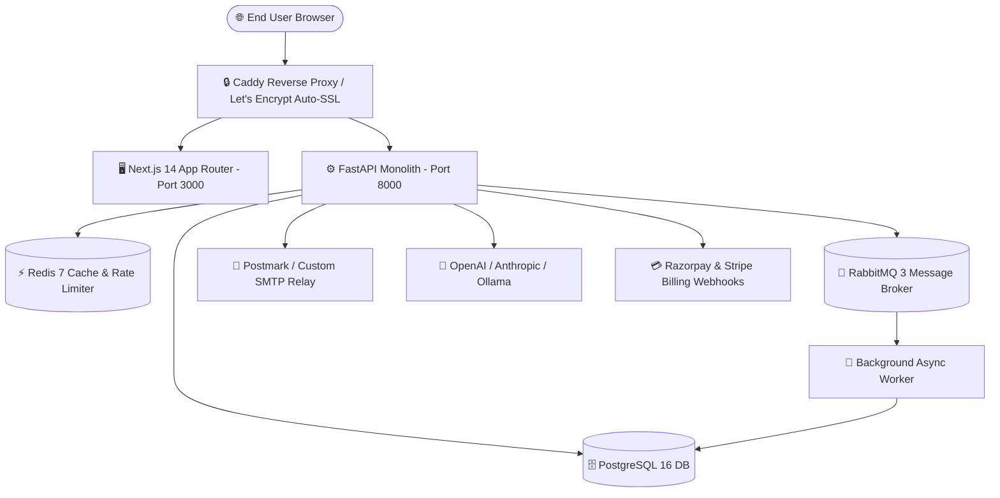

# 🚀 Growixa — AI-Powered Growth & Digital Agency Operating System 🌟

[](https://growixa.iitdeveloper.com)
[](https://uat.growixa.iitdeveloper.com)
[](https://nextjs.org)
[](https://fastapi.tiangolo.com)
[](https://www.postgresql.org)
[](#-license)

**Growixa** is an enterprise-grade, AI-powered Growth & Digital Agency Operating System designed for modern businesses, growth teams, and marketing agencies. It unifies Audience CRM, Creative Studio, PPC Ads Hub, Omnichannel SMS & WhatsApp, SEO Audit & Intelligence, AI Marketing Planner, Landing Page Builder, Social Media Publishing, Email Deliverability, Real-Time Telemetry, and SaaS Billing into **one cohesive command hub**.

> 🌐 **Live Production App**: [https://growixa.iitdeveloper.com](https://growixa.iitdeveloper.com)  
> 🧪 **Live UAT / Staging App**: [https://uat.growixa.iitdeveloper.com](https://uat.growixa.iitdeveloper.com)

---

## 🔁 The Ecosystem OS Architecture Loop 🔄



---

## 🌟 21 Core Modules (A-to-Z Platform Scope) 💎

| # | Module | Key Capabilities & Implementation Scope | Status |
|---|---|---|---|
| **1** | 🔐 **Foundation & Multi-Tenancy** | Strict account isolation per tenant, Keycloak/Google OAuth 2.0, JWT session cookies, Argon2id hashing, Fernet credential encryption. | 🟢 **100% Live** |
| **2** | 📇 **CRM, Contacts & Leads** | Dynamic custom fields, tag management, multi-segment query engine, insert-only consent audit logs, and wildcard domain suppression. | 🟢 **100% Live** |
| **3** | 🎨 **Creative Studio & Brand Kit** | AI social creatives, banners, flyers, posters, ad stories, digital business cards, multi-preset resizer, and brand kit manager (`/creative`). | 🟢 **100% Live** |
| **4** | 📊 **Ads Hub (Google & Meta)** | Multi-channel PPC campaign planner, target audience presets, real-time ROAS budget calculator & UTM URL Builder (`/ads`). | 🟢 **100% Live** |
| **5** | 🧲 **Lead Gen & Capture Forms** | Custom embeddable lead capture forms, lead routing rules, real-time notification hooks & conversion score table (`/lead-gen`). | 🟢 **100% Live** |
| **6** | 💬 **Omnichannel Communications** | WhatsApp API & SMS connection manager, template studio, broadcast sender & instant OTP verification service (`/communications`). | 🟢 **100% Live** |
| **7** | 🧠 **AI Marketing Strategy Planner** | Automated 30-day marketing strategy generator, campaign task breakdowns, content calendar matrix & channel budget allocator (`/planner`). | 🟢 **100% Live** |
| **8** | 🌐 **Website & Business Presence** | Micro-landing page builder, customizable link-in-bio hub, CTA click analytics & social profile optimizer (`/business-presence`). | 🟢 **100% Live** |
| **9** | 🔍 **SEO Audit & Intelligence** | Live BeautifulSoup web page analyzer (`GET /seo/analyze`), on-page meta check, heading hierarchy breakdown, and keyword planner (`/seo`). | 🟢 **100% Live** |
| **10** | ✉️ **Email, SMTP & Postmark** | Dual-relay transport (Postmark & Custom SMTP TLS), visual template builder, Postmark webhooks (`/webhooks/postal`), List-Unsubscribe headers. | 🟢 **100% Live** |
| **11** | 📱 **Social Composer & Calendar** | Multi-account publisher, Instagram Business OAuth 2.0, interactive calendar view, drag-and-drop scheduling & async RabbitMQ queue. | 🟢 **100% Live** |
| **12** | 🖼️ **Media Assets Manager** | Supabase Storage integration, tag-based filtering, drag-and-drop file upload grid, and image asset transform preview. | 🟢 **100% Live** |
| **13** | 🤖 **AI Assistant & Guardrails** | OpenAI GPT-4o, Anthropic Claude 3.5, Ollama fallback, custom brand guardrails, safety rules, and credit usage metering. | 🟢 **100% Live** |
| **14** | 🎯 **Campaign Manager** | Segment-targeted campaign execution, test send mode, scheduled ticker background dispatch, and delivery analytics. | 🟢 **100% Live** |
| **15** | ⚡ **Workflow Automation** | Event-driven trigger-action workflow builder (`automations/models.py`), conditional branches, and execution logs. | 🟢 **100% Live** |
| **16** | 📥 **Unified Inbox** | Real-time WebSockets (`/inbox/ws`) with tenant cookie auth, live conversation streams, and message status sync. | 🟢 **100% Live** |
| **17** | 📈 **Analytics & Telemetry** | SVG Candlestick (OHLC) & Area Spline terminal with multi-timeframe toggles (1H to 1Y) and real-time revenue telemetry. | 🟢 **100% Live** |
| **18** | 🏢 **Agency & Client Portal** | Multi-client tenant switcher, white-label branding controls, and client account isolation. | 🟢 **100% Live** |
| **19** | 💳 **SaaS Billing & Subscriptions** | Razorpay & Stripe integration, automatic tier management, add-on credit top-ups, period-resetting quotas & coupon engine. | 🟢 **100% Live** |
| **20** | 🛡️ **Security Control Plane** | Insert-only audit logging (`/dashboard/audit`), platform control plane (`/platform`), Redis rate limiting, and RBAC policy enforcement. | 🟢 **100% Live** |
| **21** | 🗺️ **Website Shell & Roadmap** | Rotated `GROWIXA` background watermark, connected Ecosystem OS architecture, and multi-level service header top bar. | 🟢 **100% Live** |

---

## 🎨 Visual Design System & Aesthetics 🌌

- **Palette**: Signature Pantone Cherry (`#6D0626`), Warm Cream/Ivory (`#F7F1EA`), Crimson Accent (`#A01B42`), and Dark Slate Navy.
- **Top Utility Header**: Phone (`+91-9205067380`), Email (`info@growixa.com`), Quick links, WhatsApp CTA button, `Growixa®` brand logo, and 4 multi-level service dropdowns (`SMS & WhatsApp`, `Digital Services`, `Website & SEO`, `Enterprise`).
- **Product Roadmap (`/roadmap`)**: Rotated `GROWIXA` background watermark, interactive stage filters, ecosystem architecture diagram, and 4-pillar benefit strip.

---

## 🏗️ System Architecture & Deployment Stack 🛠️



---

## 💻 Local Quick Start Guide ⚡

### 1️⃣ Prerequisites 🧰
- **Node.js 20+** & `npm`
- **Python 3.10+** & `pip` / `.venv`
- **Docker & Docker Compose** (for PostgreSQL, Redis, RabbitMQ)

### 2️⃣ Frontend Setup (`apps/web`) 🖥️
```bash
cd apps/web
npm install
npm run dev
```
Open [http://localhost:3000](http://localhost:3000) in your browser.

### 3️⃣ Backend Setup (`apps/api`) ⚙️
```bash
cd apps/api
python -m venv .venv
.\.venv\Scripts\activate  # On Windows

# Install dependencies and start FastAPI server
pip install -e .
$env:PYTHONPATH="src"
python -m uvicorn growixa_api.main:app --host 127.0.0.1 --port 8000 --reload
```
Interactive API documentation: [http://localhost:8000/docs](http://localhost:8000/docs).

---

## 🛡️ Quality Assurance & Automated Pipeline Checks 🧪

All quality and security checks must pass cleanly prior to release tagging:

```bash
# 🖥️ Frontend Checks (apps/web)
npm run lint          # 🟢 0 errors, 0 warnings
npm run typecheck     # 🟢 0 TypeScript errors across 80+ routes
npm run test          # 🟢 Vitest suite passing cleanly
npm run build         # 🟢 Next.js production build verified

# ⚙️ Backend Checks (apps/api)
.\.venv\Scripts\python.exe -m pytest -m "not integration"  # 🟢 100% unit tests PASSED
.\.venv\Scripts\python.exe -m pytest tests/permissions/test_cross_tenant_isolation.py  # 🟢 100% PASSED
alembic check         # 🟢 Clean schema state
```

---

## 🚀 OVH VPS Deployment & Release Notes 📦

- **Target VPS Server**: `149.56.101.2` (OVHcloud, 6 vCores, 12GB RAM)
- **Git Branch**: `feature/BACKEND/GRX-A2Z-AUDIT-UPGRADE` (Commit `186186e`)
- **Git Remotes**: `origin` (`iitdeveloper-git/growixa`) & `upstream` (`Itssushmasharma/growixa_project`)
- **Active Release Tag**: `v0.9.0-rc1` (UAT Staging Tag)

---

## 📄 License & Ownership 📜

Proprietary Software — All rights reserved by **Growixa Growth Platform** & **IIT Developer Team**.  
Made with ❤️ and ☕ for Growth Engineers & Marketing Agencies worldwide! 🌍🚀
