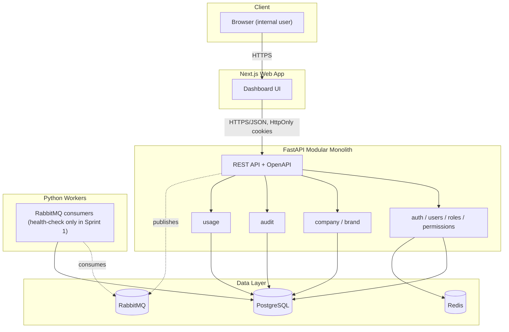

# System Architecture

- Document ID: DOC-ARCH-SYSTEM
- Status: ACTIVE
- Version: 1.0
- Last updated: 2026-07-22
- Owner: Coding agent
- Related documents: [MODULE_BOUNDARIES](MODULE_BOUNDARIES.md), [BACKGROUND_JOB_ARCHITECTURE](BACKGROUND_JOB_ARCHITECTURE.md), [DATA_MODEL](../05-data/DATA_MODEL.md), [SECURITY_ARCHITECTURE](../08-security/SECURITY_ARCHITECTURE.md), [DECISIONS §DEC-GRX-003/004](../00-project-control/DECISIONS.md)

## Architecture style

Modular monolith backend (FastAPI) with independently scalable Python workers, per
[DEC-GRX-003](../00-project-control/DECISIONS.md). One microservice per module or per AI
agent is explicitly rejected for MVP — module boundaries (see
[MODULE_BOUNDARIES.md](MODULE_BOUNDARIES.md)) keep a future service split possible without
requiring it now.

## Components

| Component | Technology | Role |
|---|---|---|
| Web frontend | Next.js / TypeScript / React | Dashboard UI; server-side rendering where useful, client interactions where required |
| Backend API | FastAPI / Python / Pydantic / SQLAlchemy / Alembic | Single deployable modular monolith exposing REST + OpenAPI |
| Workers | Python (RabbitMQ consumers) | Scheduled execution, retries, async processing — no business workers run in Sprint 1 (see [BACKGROUND_JOB_ARCHITECTURE.md](BACKGROUND_JOB_ARCHITECTURE.md)) |
| Database | PostgreSQL | Single source of truth for all application data |
| Cache / coordination | Redis | Caching, distributed locks, rate limiting (login rate limiting in Sprint 1), idempotency keys, short-lived state |
| Queue | RabbitMQ | Durable job queue for workers; Sprint 1 only requires connectivity + health check |
| Object storage | S3-compatible | Media/report/artifact storage — not required until Slice 5 (social media); no dependency in Sprint 1 |
| Identity | Application-managed (FastAPI) | See [AUTHENTICATION.md](../08-security/AUTHENTICATION.md); adapter boundary for future OIDC/SSO |

## Backend module list (modular monolith)

```text
auth
users
roles
permissions
company
brand
contacts
imports
tags
segments
templates
campaigns
email_delivery
social
content_calendar
ai
automation
analytics
notifications
integrations
usage
billing
audit
admin
files
webhooks
```

Sprint 1 implements: `auth`, `users`, `roles`, `permissions`, `company`, `brand` (minimal),
`audit`, `admin` (minimal), plus the cross-cutting `usage` metering foundation. All other
modules exist as directory scaffolding at most (see [MODULE_BOUNDARIES.md](MODULE_BOUNDARIES.md))
and must not contain business logic yet — see [DEFINITION_OF_DONE.md §No placeholder
completion](../00-project-control/DEFINITION_OF_DONE.md#no-placeholder-completion).

## Container diagram



Source: [`docs/diagrams/container-architecture.mmd`](../diagrams/container-architecture.mmd).

## Environment separation

Local development runs the full stack via Docker Compose (Postgres, Redis, RabbitMQ,
backend, frontend). Staging/production targets are not yet decided ([OQ-006](../00-project-control/OPEN_QUESTIONS.md))
but must not block Sprint 1, which only requires local Docker Compose. See
`docs/11-devops/LOCAL_DEVELOPMENT.md` (to be created alongside Sprint 1 implementation).

## Architecture constraints

- All long-running operations must be asynchronous, resumable, and observable.
- External API calls (once providers exist, post-Sprint-1) require retries, backoff,
  circuit breakers, and rate-limit handling.
- Provider/model configuration must never be hard-coded — configuration-driven per
  [DEC-GRX-005](../00-project-control/DECISIONS.md).
- Customer/user data must never be placed directly into logs or (later) AI prompts beyond
  authorized context (GRX-AI-005/006, PRD §23).
- No `tenant_id`/`workspace_id` on tables — single-tenant per [DEC-GRX-002](../00-project-control/DECISIONS.md); use ownership fields (`created_by_user_id`, etc.) instead.
