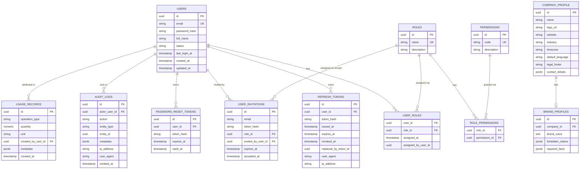
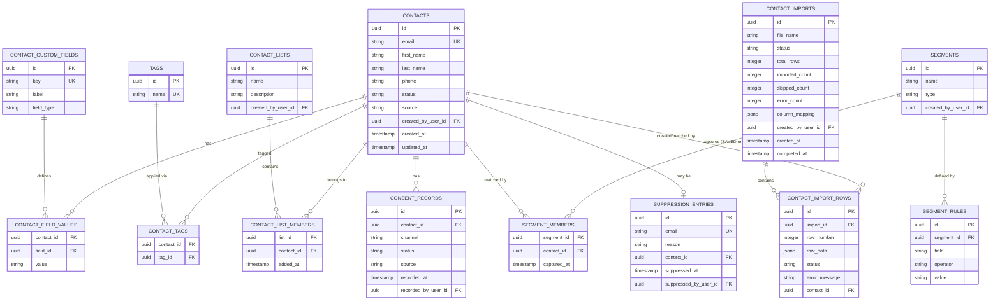
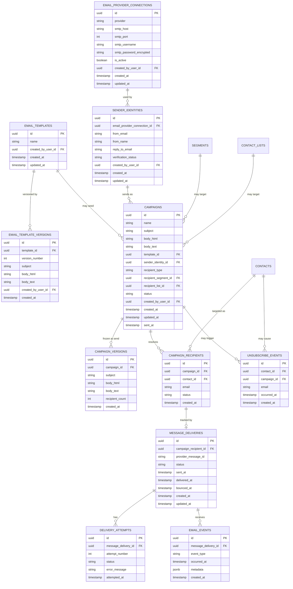
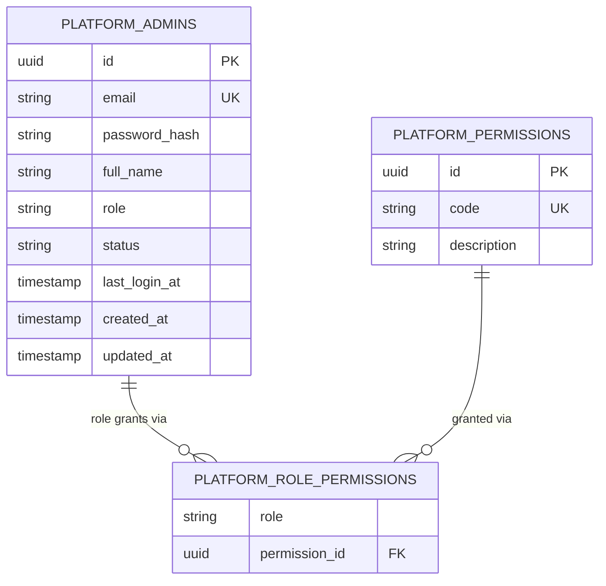

# Entity-Relationship Diagram

- Document ID: DOC-ERD
- Status: ACTIVE (expanded per slice, not redesigned)
- Version: 1.3
- Last updated: 2026-08-07
- Owner: Coding agent
- Related documents: [DATA_MODEL](DATA_MODEL.md), [DATABASE_SCHEMA](DATABASE_SCHEMA.md)

Source: [`docs/diagrams/er-diagram.mmd`](../diagrams/er-diagram.mmd).

## Slice 2 (Contacts) additions

## Slice 3 (Email Marketing) additions

`campaign_schedules` (Slice 4) and generic `webhook_*` tables (deferred indefinitely) are
intentionally absent — see [DATA_MODEL.md §Explicitly deferred, not designed in Slice
3](DATA_MODEL.md#explicitly-deferred-not-designed-in-slice-3).

Entities for `social` and `ai` are added to this diagram as their owning slice is designed
(Slice 5, 6 respectively) — see
[DATA_MODEL.md §Full MVP entity landscape](DATA_MODEL.md#full-mvp-entity-landscape-target-slice).

## Sprint 5 Phase B (Platform auth boundary) additions

Deliberately its own diagram, not merged into the entities above — `platform_admins` has
no relationship to `accounts`, `users`, or any account-scoped entity by design (see
[DATA_MODEL.md §Sprint 5 Phase B entities](DATA_MODEL.md#sprint-5-phase-b-entities-customer-account-platform--platform-auth-boundary-full-detail)).

